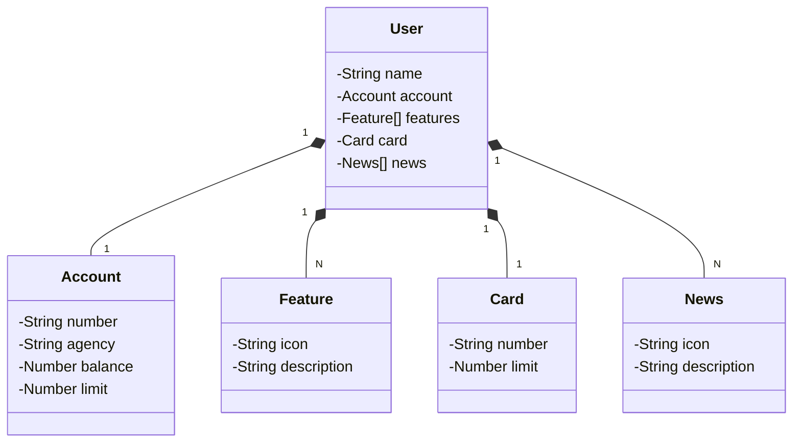

# Santander Backend 2024

Java RESTful API criada para a Santander 2024 - Backend com Java.

## Principais Tecnologias
 - **Java 21**: Utilizaremos a versão LTS mais recente do Java para tirar vantagem das últimas inovações que essa linguagem robusta e amplamente utilizada oferece;
 - **Spring Boot 3**: Trabalharemos com a mais nova versão do Spring Boot, que maximiza a produtividade do desenvolvedor por meio de sua poderosa premissa de autoconfiguração;
 - **Spring Data JPA**: Exploraremos como essa ferramenta pode simplificar nossa camada de acesso aos dados, facilitando a integração com bancos de dados SQL;
 - **OpenAPI (Swagger)**: Vamos criar uma documentação de API eficaz e fácil de entender usando a OpenAPI (Swagger), perfeitamente alinhada com a alta produtividade que o Spring Boot oferece;
 - **Railway**: facilita o deploy e monitoramento de nossas soluções na nuvem, além de oferecer diversos bancos de dados como serviço e pipelines de CI/CD.

## [Link do Figma](https://www.figma.com/file/0ZsjwjsYlYd3timxqMWlbj/SANTANDER---Projeto-Web%2FMobile?type=design&node-id=1421%3A432&mode=design&t=6dPQuerScEQH0zAn-1)

O Figma foi utilizado para a abstração do domínio desta API, sendo útil na análise e projeto da solução.

## Diagrama de Classes (Domínio da API)



## Como inicializar o projeto
- Para incializar o projeto usando o profile de dev `application-dev.yml` rode o commando:

    >  `./gradlew bootRun --args='--spring.profiles.active=dev'`

- Para inicializar usando o profile de produção `application-prd.yml` rode o commando:
  >  `./gradlew bootRun --args='--spring.profiles.active=dev'`

   obs: vale lembrar que no `application-prd.yml` estou utilizando variaveis de ambiente do sistema para passa as credencias do banco de dados PostgreSQL que está rodando no railway. Recomendo a criação de um arquivo .sh para carregar as credenciais apenas no momento de inicializar a applicação.

  `env-vars.sh`
  ```
  #!/bin/bash
  export PGHOST=<host-do-seu-banco>
  export PGPORT=<porta-do-seu-banco>
  export PGDATABASE=<nome-do-seu-banco>
  export PGUSER=<user-do-seu-banco>
  export PGPASSWORD=<senha-do-seu-banco>
  ```
  No terminal rode o commando:
  > source env-vars.sh

  para carregar as variáveis de ambiente durante a instância do terminais.